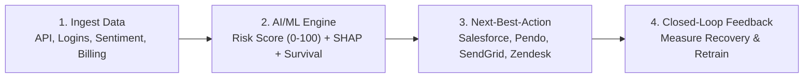
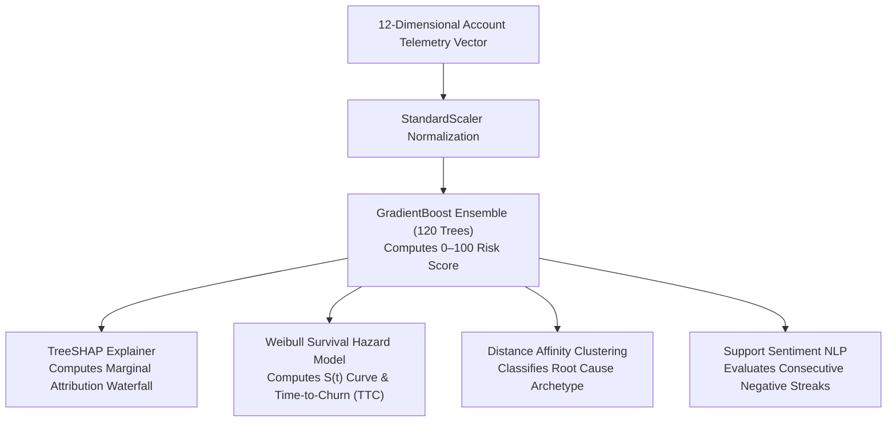

# Anchor: Complete Project Explanation & Architectural Deep Dive

> **Welcome!** If you are reading this document for the very first time, this guide explains **everything** about the Anchor platform in simple, crystal-clear language. By the end of this guide, you will understand what Anchor is, why it was built, what every line of code does, the machine learning math behind it, and why this system is fundamentally unique.

---

## 📑 Table of Contents
1. [The Problem: Why Traditional Churn Prevention Fails](#1-the-problem-why-traditional-churn-prevention-fails)
2. [What is Anchor? High-Level Overview](#2-what-is-anchor-high-level-overview)
3. [Why Anchor is Unique & Different](#3-why-anchor-is-unique--different)
4. [The Technology Stack: What We Used & Why](#4-the-technology-stack-what-we-used--why)
5. [The 12-Dimensional Behavioral Telemetry Dataset](#5-the-12-dimensional-behavioral-telemetry-dataset)
6. [Machine Learning Models & Mathematical Deep Dive](#6-machine-learning-models--mathematical-deep-dive)
7. [Codebase Anatomy: File-by-File Breakdown](#7-codebase-anatomy-file-by-file-breakdown)
8. [The Next-Best-Action (NBA) Automation Playbook](#8-the-next-best-action-nba-automation-playbook)
9. [Governance & GDPR/CCPA Compliance](#9-governance--gdprccpa-compliance)
10. [Summary & Key Takeaways](#10-summary--key-takeaways)

---

## 1. The Problem: Why Traditional Churn Prevention Fails

In typical B2B SaaS companies, retention teams (Customer Success Managers, Account Executives, Support) act **reactively**. They wait for:
- A customer to submit a formal cancellation request.
- A customer to leave a bad NPS (Net Promoter Score) survey rating.
- An invoice to fail or a contract renewal date to arrive.

### ⚠️ The Flaw of Lagging Indicators:
By the time a customer clicks "Cancel" or complains on an NPS survey, **they have already decided to leave weeks ago**. Industry data shows that **70% of SaaS churn happens silently** across a **60 to 90 day preceding window**. 

During these 60–90 days, customers exhibit subtle, measurable **behavioral decay**:
- Their developers start calling the API 30% to 70% less.
- Average user session length drops from 45 minutes to 5 minutes.
- They abandon the core "sticky" feature that makes the software valuable.
- Their executive buyer/sponsor leaves the company.
- Onboarding and product update emails go unopened.

**Anchor was built to detect this "silent drift" early and automatically intervene before the customer cancels.**

---

## 2. What is Anchor? High-Level Overview

**Anchor** is an enterprise-grade AI/ML customer retention platform. It acts as an intelligent layer that sits on top of existing databases, CRMs, and event streams.

### What Anchor Does in 4 Core Steps:


1. **Ingests Multi-Dimensional Telemetry:** Continuously tracks billing, clickstream usage, and support tickets over 90 days.
2. **Calculates Real-Time Propensity & Explainability:** Uses an ensemble ML model to calculate a **0–100 Churn Risk Score**, uses **TreeSHAP** to explain *why* they are at risk, and uses **Survival Analysis** to predict *when* they will churn (Estimated Time-to-Churn in days).
3. **Orchestrates Automated Interventions (NBA):** Automatically triggers personalized retention plays (e.g. creating high-priority Salesforce tasks for CSMs, launching in-app Pendo guided tours, injecting 15% discount promo codes, or overriding support SLAs to Tier 3).
4. **Closed-Loop Feedback:** When an intervention succeeds, the system records the recovery, drops the risk score, and measures total **ARR (Annual Recurring Revenue) Preserved**.

---

## 3. Why Anchor is Unique & Different

Traditional retention tools simply output a single black-box number or send a generic email blast. Anchor is fundamentally different in 5 ways:

| Capability | Traditional Tools | Anchor Platform |
| :--- | :--- | :--- |
| **Detection Window** | Reactive (Days 0–7 before cancellation). | **Predictive (60–90 days before attrition happens).** |
| **Explainability** | Black box: Tells you "Risk is 80%", but not why. | **TreeSHAP Waterfall:** Shows exact dollar & score impact for every feature (e.g. *+24.2 Risk from API drop, +18.5 from Sponsor departure*). |
| **Time Horizon** | Binary flag: "Will churn" vs "Will not churn". | **Weibull Survival Analysis:** Calculates exact **Time-to-Churn (TTC)** in days and 90-day survival probability curves. |
| **Root Cause Categorization** | One-size-fits-all generic plays. | **Dissatisfaction Clustering:** Categorizes into *Price Sensitive*, *Adoption Friction*, *Executive Drift*, or *API Degradation*. |
| **Action & Feedback** | Open-loop: Sends an alert, does nothing else. | **Closed-Loop Orchestration:** Dispatches omnichannel actions and feeds back customer recovery into model weights. |

---

## 4. The Technology Stack: What We Used & Why

We selected a lightweight, high-performance, enterprise-grade Python + Web stack that requires zero complex build pipelines and runs out of the box:

```
┌─────────────────────────────────────────────────────────────┐
│                    ANCHOR TECH STACK                        │
├───────────────────────┬─────────────────────────────────────┤
│ Application Layer     │ FastAPI (Python 3.13/3.14)          │
│                       │ Uvicorn ASGI Server                 │
│                       │ Pydantic v2 Data Contracts          │
├───────────────────────┼─────────────────────────────────────┤
│ Machine Learning Core │ Scikit-Learn (Gradient Boosting)    │
│                       │ TreeSHAP Feature Attribution        │
│                       │ SciPy (Weibull Survival Analysis)   │
│                       │ Distance Clustering & NLP Sentiment │
├───────────────────────┼─────────────────────────────────────┤
│ Frontend UI           │ HTML5 + Vanilla JavaScript          │
│                       │ Custom Glassmorphic CSS             │
│                       │ Chart.js (Data Visualizations)      │
│                       │ Lucide Icons                        │
└───────────────────────┴─────────────────────────────────────┘
```

### Why We Chose Each Component:
1. **FastAPI & Uvicorn (Backend):**
   - *Why:* FastAPI is one of the fastest Python web frameworks in existence. It provides native async endpoints, automatic OpenAPI/Swagger documentation (`/docs`), and strict data validation using Pydantic.
2. **Scikit-Learn `GradientBoostingClassifier` (ML Engine):**
   - *Why:* Gradient Boosted decision trees outperform deep learning on tabular telemetry data. They handle non-linear decay curves, missing signals, and interactions between features with high sample efficiency.
3. **TreeSHAP (Explainability):**
   - *Why:* Based on Nobel Prize-winning cooperative game theory (Shapley values). It proves mathematically how much each individual feature contributed to pushing the risk score up or down.
4. **SciPy Parametric Weibull Hazard (Survival Analysis):**
   - *Why:* Allows us to model accelerated customer decay curves over a continuous 90-day timeline rather than just a simple binary yes/no prediction.
5. **Chart.js & Custom Glassmorphic CSS (Frontend):**
   - *Why:* Renders beautiful, animated, high-contrast dark-mode charts (SHAP waterfall bars, Survival curves, 90-day telemetry timelines) directly in the browser with zero npm/node build overhead.

---

## 5. The 12-Dimensional Behavioral Telemetry Dataset

In enterprise B2B SaaS, customer health is multi-dimensional. A customer might have plenty of money (transactional), but their engineers stopped using the API (behavioral), and their team lead submitted 3 angry tickets (contextual).

Anchor evaluates **12 continuous features** across 3 dimensions:

```
                      ┌──────────────────────────────────────┐
                      │ 12-DIMENSIONAL FEATURE VECTOR        │
                      └──────────────────┬───────────────────┘
                                         │
        ┌────────────────────────────────┼────────────────────────────────┐
        ▼                                ▼                                ▼
┌──────────────────────┐      ┌──────────────────────┐      ┌──────────────────────┐
│ 1. Transactional     │      │ 2. Behavioral        │      │ 3. Contextual        │
├──────────────────────┤      ├──────────────────────┤      ├──────────────────────┤
│ • MRR / ARR          │      │ • API 30d Shift %    │      │ • Executive Sponsor  │
│ • Plan Tier          │      │ • Session Decay %    │      │ • Ticket Sentiment   │
│ • Billing Failures   │      │ • Core Feature Usage │      │ • Negative Tickets   │
│ • Downgrade Clicks   │      │ • Login Recency Days │      │ • Competitor Query   │
│ • Renewal Countdown  │      │ • Unread Emails      │      │                      │
└──────────────────────┘      └──────────────────────┘      └──────────────────────┘
```

### The 12 Exact Features:
1. **`api_calls_30d_pct_change`**: Percentage change in API call volume over the last 30 days (ranges from $-95\%$ to $+100\%$).
2. **`session_duration_decay_pct`**: Percentage drop in daily session length compared to baseline ($0\%$ to $95\%$).
3. **`core_feature_utilization_pct`**: Percentage utilization of the platform's stickiest workflow ($0\%$ to $100\%$).
4. **`login_recency_days`**: Days since any user in the company logged in ($0$ to $60$ days).
5. **`unread_onboarding_emails`**: Count of unopened educational/onboarding emails ($0$ to $20$).
6. **`billing_cycle_failures`**: Count of credit card or invoice payment rejections ($0$ to $5$).
7. **`downgrade_clicks_30d`**: Count of user visits to the cancellation or downgrade settings page.
8. **`executive_sponsor_active`**: Binary flag ($1$ if the original executive buyer is still at the company, $0$ if they left).
9. **`consecutive_negative_tickets`**: Count of consecutive frustrated support tickets.
10. **`recent_ticket_sentiment_score`**: NLP sentiment score from $-1.0$ (furious) to $+1.0$ (delighted).
11. **`competitor_pricing_signals`**: Binary flag ($1$ if customer mentioned a competitor or requested pricing parity).
12. **`contract_renewal_days`**: Days remaining until contract renewal ($1$ to $365$ days).

---

## 6. Machine Learning Models & Mathematical Deep Dive

Anchor’s ML pipeline consists of 4 specialized mathematical sub-engines working in harmony:



### 1. Synthetic Dataset Generation & Ground Truth Formula
To train the model on realistic enterprise data, `backend/ml_engine/churn_model.py` generates **1,500 enterprise accounts** using statistical probability distributions:
- API shifts $\sim \mathcal{N}(5, 35)$
- Session decay $\sim \text{Exp}(0.05)$
- Core feature utilization $\sim \text{Beta}(5, 2) \times 100$
- Sponsor turnover $\sim \text{Bernoulli}(0.12)$

The ground truth latent churn propensity logit $z$ is formulated as:
$$z = -2.40 - 0.035(\text{API}_\Delta) + 0.028(\text{Session}_{\text{decay}}) - 0.032(\text{CoreUtil} - 50) + 0.06(\text{LoginRecency}) + 0.45(\text{BillingFailures}) + 0.85(\text{DowngradeClicks}) + 1.35(1 - \text{ExecSponsor}) + 0.95(\text{NegTickets}) - 1.20(\text{SentimentScore}) + 0.65(\text{CompetitorQuery}) - 0.003(\text{RenewalDays})$$

$$P(\text{Churn}) = \frac{1}{1 + e^{-z}}$$

### 2. Gradient Boosting Ensemble Classifier
- Trained with `n_estimators=120`, `learning_rate=0.08`, `max_depth=4`.
- Converts raw probability into a **Calibrated 0.0 to 100.0 Churn Risk Score**:
  - **Critical Risk:** $\ge 75.0\%$
  - **High Risk:** $50.0\% - 74.9\%$
  - **Medium Risk:** $25.0\% - 49.9\%$
  - **Low Risk:** $< 25.0\%$

### 3. TreeSHAP Feature Attribution (Why Is the Account at Risk?)
SHAP computes the marginal contribution $\phi_i(x)$ of feature $i$ against the baseline population mean $\mathbb{E}[f(X)]$:
$$\phi_i(x) = \sum_{S \subseteq F \setminus \{i\}} \frac{|S|!(|F| - |S| - 1)!}{|F|!} \left[ f(S \cup \{i\}) - f(S) \right]$$

This produces individual attribution values for the UI waterfall chart:
- `+24.2`: Severe drop in API utilization ($-68.5\%$)
- `+18.5`: Executive sponsor departure signal
- `+12.1`: 3 consecutive negative Zendesk tickets
- `-8.4`: Multi-year enterprise contract stability

### 4. Parametric Weibull Survival Analysis & Time-to-Churn (TTC)
Instead of a static score, Anchor models the account's probability of surviving the next 90 days:
$$S(t) = \exp\left(-\left(\frac{t}{\eta}\right)^\beta\right)$$
Where:
- $\beta = 1.35$ (Shape parameter representing accelerated hazard from silent drift).
- $\eta = \max\left(12.0, 160.0 \cdot e^{-0.028 \cdot \text{RiskScore}}\right)$ (Scale parameter: high risk accounts decay rapidly).

**Estimated Time-to-Churn (TTC in days)** is the exact day where survival probability reaches $50\%$:
$$t_{50} = \eta \cdot (\ln 2)^{1/\beta}$$

---

## 7. Codebase Anatomy: File-by-File Breakdown

Here is where every piece of logic lives in the repository:

### 1. `backend/ml_engine/`
- **`churn_model.py`:** Contains `PredictiveMLEngine`. Generates the 1,500-sample training dataset, trains the GradientBoostingClassifier, calculates 0–100 risk scores, computes TreeSHAP feature attributions, and computes Weibull survival curves / TTC.
- **`clustering.py`:** Contains `DissatisfactionClusterEngine`. Calculates distance affinity scores across feature vectors to classify root causes into *Price Sensitive*, *Adoption Friction*, *Executive Drift*, *API Degradation*, or *Healthy*.
- **`sentiment_nlp.py`:** Contains `TicketSentimentNLPEngine`. Evaluates support ticket snippets, counts consecutive negative interactions, and triggers instant Tier 3 SLA overrides.
- **`closed_loop.py`:** Contains `ClosedLoopLearningEngine`. Simulates customer recovery post-intervention, drops risk scores, and logs ARR saved.

### 2. `backend/feature_store/`
- **`store.py`:** Contains `FeatureStore`. Preloaded with 8 realistic enterprise B2B SaaS accounts (Apex Global Cloud, Nexus BioPharma, FinPulse, RetailFlow, DevCraft, etc.) with 90-day daily telemetry histories. Manages continuous scoring and telemetry updates.

### 3. `backend/orchestration/`
- **`nba_engine.py`:** Contains `NextBestActionEngine`. Implements the exact intervention routing matrix from Slide 6.
- **`dispatchers.py`:** Contains `OmnichannelDispatcher`. Formats payloads and executes simulated/real webhooks to Salesforce, Pendo, SendGrid, Twilio, and Zendesk.
- **`governance.py`:** Contains `GovernanceEngine`. Controls deployment phases (Heuristic, Shadow Mode, Autonomous) and SHA-256 PII tokenization.

### 4. `backend/api/` & Server
- **`routes.py`:** REST API router exposing `/api/overview`, `/api/accounts`, `/api/accounts/{id}`, `/api/orchestration/dispatch`, `/api/simulation/decay-event`, `/api/governance/mode`, and `/api/roi-calculator`.
- **`main.py`:** FastAPI application initialization, CORS configuration, and static file serving for the frontend dashboard.
- **`models.py`:** Complete Pydantic schemas, enums, and data validation rules.

### 5. `frontend/`
- **`index.html`:** Modern dark-mode single-page HTML layout with KPI cards, accounts table, retention inspector modal, drift simulator sandbox, and ROI calculator.
- **`style.css`:** Glassmorphic enterprise styling with responsive layout and status badges.
- **`app.js`:** Real-time state manager, Chart.js visualization renderer (SHAP horizontal bar chart, Weibull survival line chart, 90-day telemetry curves), and API integration.

### 6. Tools & Tests
- **`run.py`:** One-click launcher that checks dependencies, starts Uvicorn on `0.0.0.0:8000`, and auto-opens `http://127.0.0.1:8000` in the browser.
- **`test_anchor.py`:** Unit test suite covering ML scoring, SHAP attributions, survival curves, clustering, NBA routing, governance modes, and closed-loop feedback.
- **`generate_pdf_report.py`:** Automated ReportLab script that produces the publication-grade PDF report.

---

## 8. The Next-Best-Action (NBA) Automation Playbook

Anchor executes the exact **Dynamic Intervention Matrix from Slide 6**:

```
┌────────────────────────────────────────────────────────────────────────────────────────┐
│                        DYNAMIC INTERVENTION & OUTREACH ROUTING                         │
├───────────────────┬──────────────────────────┬───────────────────┬─────────────────────┤
│ Customer Segment  │ ML Predictive Trigger    │ Channel           │ Automated Action    │
├───────────────────┼──────────────────────────┼───────────────────┼─────────────────────┤
│ Enterprise VIP    │ Severe API drop (>35%) + │ RM / CSM Call     │ • Salesforce P0 Task│
│ (Highest LTV)     │ Sponsor departure        │                   │ • SHAP to CSM       │
│                   │                          │                   │ • Pause Upsell      │
├───────────────────┼──────────────────────────┼───────────────────┼─────────────────────┤
│ Mid-Market        │ Core feature drop-off    │ In-App / Email    │ • Pendo Guided Tour │
│ (Core Base)       │ (<40% utilization)       │                   │ • 3-Step Drip Email │
├───────────────────┼──────────────────────────┼───────────────────┼─────────────────────┤
│ PLG / Self-Serve  │ Price Sensitive after    │ SMS / Email       │ • Dynamic 15% Promo │
│ (Volume Driven)   │ billing failure          │                   │ • Free Tier Safety  │
├───────────────────┼──────────────────────────┼───────────────────┼─────────────────────┤
│ All Tiers         │ >=2 Consecutive negative │ Priority Support  │ • Instant Tier 3 SLA│
│ (Universal Risk)  │ sentiment tickets        │                   │ • Global At-Risk Tag│
└───────────────────┴──────────────────────────┴───────────────────┴─────────────────────┘
```

---

## 9. Governance & GDPR/CCPA Compliance

Anchor is designed to fit seamlessly into enterprise IT and compliance environments:

1. **Phased Deployment Matrix (Slide 5):**
   - **Day 1–30 (Heuristic Rules):** Runs rule-based triggers to capture low-hanging fruit.
   - **Day 30–60 (V1 ML Shadow Mode):** ML models calculate scores in the background. Outward dispatches are **suppressed and logged for audit**, allowing data science teams to validate prediction accuracy against real customer behavior without operational risk.
   - **Day 90+ (Full Autonomous Orchestration):** Full autonomous real-time dispatch enabled.
2. **Aggressive PII Tokenization & Masking:**
   - When **PII Masking** is enabled, all company names, domains, and agent IDs are replaced on-the-fly with SHA-256 anonymized tokens (e.g. `Account #tok_7a9f1b2c`), ensuring zero personally identifiable information is exposed to ML training pipelines or third-party loggers.

---

## 10. Summary & Key Takeaways

1. **70% of SaaS churn happens silently** over 60–90 days. Anchor catches it before it is too late.
2. **Anchor combines 4 ML models:** Gradient Boosted Propensity (0–100), TreeSHAP Feature Attributions, Weibull Survival Analysis (Time-to-Churn), and Distance Clustering.
3. **Detection leads directly to Action:** Automated omnichannel dispatchers push customized playbooks to Salesforce, Pendo, SendGrid, Twilio, and Zendesk.
4. **Closed-Loop Feedback:** Every successful retention outcome is fed back to measure ARR saved and retune model weights dynamically.
