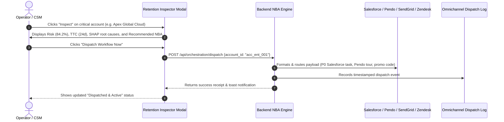
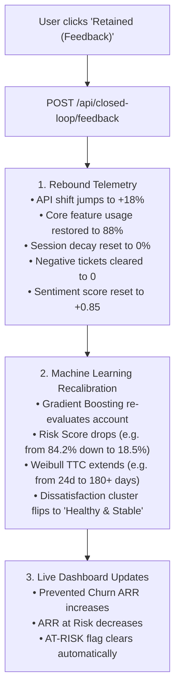

# Anchor Platform: Complete Step-by-Step User & Operator Guide

> **Welcome to the Anchor Operator Guide!** This guide walks you through every screen, card, button, and workflow on the Anchor Web Dashboard (`http://127.0.0.1:8000`). It explains step-by-step how to resolve customer issues, what is actually happening behind the scenes, and how closed-loop feedback recalibrates the machine learning models.

---

## 📑 Table of Contents
1. [Starting the Application](#1-starting-the-application)
2. [Dashboard Layout & Executive KPI Bar](#2-dashboard-layout--executive-kpi-bar)
3. [Navigating the Retention Risk Matrix](#3-navigating-the-retention-risk-matrix)
4. [Using the Deep Account Retention Inspector](#4-using-the-deep-account-retention-inspector)
5. [Step-by-Step: Resolving an At-Risk Customer (NBA Dispatch)](#5-step-by-step-resolving-an-at-risk-customer-nba-dispatch)
6. [How Closed-Loop Feedback Recalibrates the ML Model](#6-how-closed-loop-feedback-recalibrates-the-ml-model)
7. [Using the Behavioral Decay Simulator (Sandbox)](#7-using-the-behavioral-decay-simulator-sandbox)
8. [Managing Governance Modes & PII Masking](#8-managing-governance-modes--pii-masking)
9. [Using the Proof of Value & ROI Model](#9-using-the-proof-of-value--roi-model)
10. [Troubleshooting & FAQ](#10-troubleshooting--faq)

---

## 1. Starting the Application

1. Open your terminal in the project directory:
   ```powershell
   cd C:\Users\thaka\.gemini\antigravity\scratch\anchor-platform
   ```
2. Launch the platform:
   ```powershell
   py run.py
   ```
3. Keep the terminal open. Your default web browser will automatically open to:
   👉 **`http://127.0.0.1:8000`**

---

## 2. Dashboard Layout & Executive KPI Bar

At the very top of the dashboard, you will see the **Executive Overview KPI Bar**:

```
┌─────────────────────────┬─────────────────────────┬─────────────────────────┬─────────────────────────┐
│ TOTAL MONITORED ARR     │ ARR AT RISK (Risk >=50) │ PREVENTED CHURN ARR     │ AVG CHURN PROPENSITY    │
│ $1,213,976              │ $432,388 (Amber Alert)  │ $148,500 (+18.4% Lift)  │ 43.8% (Precision 91.4%) │
└─────────────────────────┴─────────────────────────┴─────────────────────────┴─────────────────────────┘
```

### What Each KPI Card Means:
1. **Total Monitored ARR:** The cumulative Annual Recurring Revenue across all accounts currently monitored by Anchor.
2. **ARR at Risk:** The total ARR attached to accounts that have a **Risk Score $\ge 50\%$**. This represents the immediate revenue at risk of silent attrition.
3. **Prevented Churn ARR:** The cumulative revenue successfully protected through Anchor's automated retention workflows and closed-loop recoveries.
4. **Average Churn Propensity:** The portfolio-wide average churn score calculated by the Gradient Boosting ML model.

---

## 3. Navigating the Retention Risk Matrix

The **Retention Risk Matrix** tab lists all monitored accounts with real-time health indicators.

### How to Filter Accounts:
- **By Customer Segment:** Click `Enterprise VIP`, `Mid-Market`, or `PLG / Self-Serve`.
- **By Risk Tier:** Click `Critical (>=75)`, `High (50-74)`, `Medium (25-49)`, or `Low (<25)`.
- **By Search Query:** Type in the top-right search box to filter by company name, domain, assigned CSM, or root cause driver.

### Understanding Table Columns:
- **Account & Segment:** Company name, domain, and segment badge (e.g. *Enterprise VIP* in purple, *Mid-Market* in blue).
- **ARR & Renewal:** Annual contract value and days remaining until renewal.
- **Propensity Score:** The real-time 0–100 risk score with a color-coded bar (Red = Critical, Orange = High, Green = Low).
- **Dissatisfaction Driver:** The underlying root cause identified by the clustering engine (e.g. *Executive Drift*, *Price Sensitive*, *Adoption Friction*).
- **Est. Time-to-Churn:** Number of days before the customer is predicted to reach the 50% attrition threshold (Weibull hazard model).
- **Next-Best-Action (NBA):** The automated channel and playbook recommended for that account.

---

## 4. Using the Deep Account Retention Inspector

Click the **`Inspect`** button on any account row to open the deep **Retention Inspector Modal**.

```
┌────────────────────────────────────────────────────────────────────────────────────────┐
│ MODAL: APEX GLOBAL CLOUD [ENTERPRISE VIP] [CRITICAL RISK]                              │
├───────────────────────┬─────────────────────────────┬──────────────────────────────────┤
│ DYNAMIC PROPENSITY    │ SURVIVAL HORIZON (TTC)      │ NEXT-BEST-ACTION (NBA)           │
│ 84.2 / 100            │ 24 Days                     │ Channel: RM / CSM Call           │
│ [===================] │ Weibull decay threshold     │ [ Dispatch Workflow Now ]        │
│                       │                             │ [ Retained (Feedback) ]          │
├───────────────────────┴─────────────────────────────┴──────────────────────────────────┤
│ CHARTS ROW:                                                                            │
│ • LEFT: SHAP Feature Attribution (Waterfall of why account is at risk)                 │
│ • RIGHT: 90-Day Survival Probability Curve S(t)                                        │
├────────────────────────────────────────────────────────────────────────────────────────┤
│ BOTTOM ROW:                                                                            │
│ • 60-90 Day Multi-Dimensional Telemetry Decay (API vs Session Mins vs Core Usage)     │
│ • Contextual Support NLP Ticket Sentiment History & Orchestration JSON Payload         │
└────────────────────────────────────────────────────────────────────────────────────────┘
```

### 1. The Dynamic Propensity Gauge (0–100)
- Displays the calibrated churn risk percentage.
- **Score $\ge 75\%$ (Critical):** Immediate churn danger.
- **Score $50\% - 74\%$ (High):** Active behavioral decay occurring.
- **Score $< 25\%$ (Low):** Healthy, engaged account.

### 2. Survival Horizon (Time-to-Churn / TTC)
- Shows how many days remain before the account hits the critical $50\%$ attrition threshold based on parametric Weibull decay equations.

### 3. TreeSHAP Feature Attribution Waterfall (Left Chart)
- **Red/Orange Bars (+ Impact):** Features that are actively **pushing churn risk up** (e.g., `+24.2` API telemetry decay, `+18.5` Executive sponsor departure).
- **Green Bars (- Impact):** Features that are **stabilizing the account** (e.g., `-8.4` multi-year contract).

### 4. 90-Day Survival Probability Curve (Right Chart)
- Visualizes the probability $S(t)$ that the account remains active from Day 0 to Day 90.

### 5. 60–90 Day Behavioral Telemetry Chart (Bottom Left)
- Compares 3 historical curves: (1) API Call Volume, (2) Core Feature Engagement Events, and (3) Daily Session Duration.

### 6. Contextual NLP Ticket Sentiment Feed (Bottom Right)
- Shows excerpts of recent support tickets with sentiment tags. If $\ge 2$ consecutive negative tickets are present, an alert badge indicates that an **SLA Tier Override** is active.

---

## 5. Step-by-Step: Resolving an At-Risk Customer (NBA Dispatch)

Here is how an operator or CSM uses Anchor to resolve a critical account:



### Step 1: Inspect the Account
1. Find an account in Critical Risk (e.g. **Apex Global Cloud**).
2. Click **`Inspect`**. Review the SHAP chart to see why it is at risk (e.g. API usage dropped $-68.5\%$ and Executive Sponsor left).

### Step 2: Click "Dispatch Workflow Now"
1. In the top-right card of the modal, click the blue **`Dispatch Workflow Now`** button.
2. A green notification toast will appear confirming:
   `"Successfully triggered RM / CSM Call workflow for Apex Global Cloud."`

### Step 3: What Actually Happens Behind the Scenes:
- For **Enterprise VIP:** Auto-generates a **P0 High-Priority Salesforce Task** assigned to the principal CSM with SHAP talking points, and pauses automated upsell marketing.
- For **Mid-Market:** Injects an in-app **Pendo guided-tour overlay** targeting admins and queues a 3-part value drip email sequence.
- For **PLG / Self-Serve:** Generates a dynamic single-use **15% discount promo code** valid for 48 hours and prompts a frictionless free-tier safety net.
- For **Consecutive Negative Tickets (All Tiers):** Overrides standard Zendesk routing to **Tier 3 Senior Support (15-min SLA)** and broadcasts an `'At-Risk'` emergency flag.

### Step 4: Verify the Dispatch Log
1. Click the **"Omnichannel Dispatch Log"** tab in the main navigation.
2. You will see the new entry with timestamp, channel, target destination, and the complete JSON payload.

---

## 6. How Closed-Loop Feedback Recalibrates the ML Model

Anchor is not a one-way alerting tool; it implements **closed-loop machine learning**.

### How to Trigger Feedback:
1. Open the inspector modal for an account that received an intervention.
2. Click the green button: **`Retained (Feedback)`**.



### What You Will See on the Dashboard:
- The modal instantly updates: **Risk Score drops from 84% $\rightarrow$ 18% (Green/Low Risk)**.
- The **ARR at Risk** KPI card decreases, and the **Prevented Churn ARR** KPI card increases.
- The account is now officially saved and stabilized.

---

## 7. Using the Behavioral Decay Simulator (Sandbox)

The **Telemetry Drift Simulator** tab allows you to test Anchor’s predictive capabilities in real time without waiting 90 days.

### How to Use the Simulator:
1. Click the **"Telemetry Drift Simulator"** tab in the top navigation.
2. Select any healthy target account from the dropdown (e.g. **Nexus BioPharma** or **QuickStack Micro**).
3. Click any of the 6 scenario injection buttons:
   - 📉 **"Inject -70% API Decay"**: Simulates a severe drop in production API usage.
   - 👤 **"Flag Sponsor Departure"**: Flags that the executive buyer left the company.
   - 💳 **"Inject Billing Failure"**: Simulates 2 payment failures and downgrade page visits.
   - 😡 **"Inject Negative Tickets"**: Logs 3 angry support tickets with negative sentiment.
   - 🚫 **"Abandon Core Feature"**: Drops core workflow usage below 20%.
   - ✨ **"Simulate Retention Recovery"**: Simulates customer accepting the retention play.
4. **Result:** The system instantly re-evaluates the account through the ML ensemble, shifts the risk score, updates SHAP attributions, and triggers autonomous routing live.

---

## 8. Managing Governance Modes & PII Masking

In the top global navigation bar, you can control the platform's deployment mode and privacy settings:

### 1. Phased Deployment Matrix Switcher (Slide 5):
- **`Day 1–30: Heuristic Rules`**: Runs baseline rule-based triggers.
- **`Day 30–60: V1 ML Shadow Mode`**: Runs the full ML model in the background. Dispatches are **suppressed and logged for audit** without sending real emails or CRM tasks.
- **`Day 90+: Full Autonomous`**: Full autonomous ML-driven execution with instant omnichannel dispatch.

### 2. PII Masking Toggle (GDPR / CCPA):
- Toggle the **"PII Masking"** switch in the top-right corner.
- **What happens:** All customer company names (e.g. *Apex Global Cloud*), domains (`apexcloud.io`), and CSM names are immediately tokenized into SHA-256 hashes (e.g. `Account #tok_8a1f2b`).

---

## 9. Using the Proof of Value & ROI Model

Click the **"Proof of Value & ROI Model"** tab to simulate financial value preservation for leadership review (Slide 7):

1. **Adjust the 4 interactive sliders:**
   - **Active Enterprise Customers:** Total customer base (e.g. 250).
   - **Average ARR per Account ($):** Mean annual contract value (e.g. $24,000).
   - **Baseline Annual Gross Churn (%):** Historical annual churn rate (e.g. 12.0%).
   - **Anchor Retention Lift (%):** Expected churn reduction (e.g. 25.0%).
2. **Instant Outputs:**
   - **Projected Annual ARR Saved:** Dollar value of recurrent revenue saved (e.g. **$180,000 / year**).
   - **Net ROI Multiple:** Return on platform investment (e.g. **4.0x ROI**).
   - **Payback Period:** Time to break-even (e.g. **3.0 months**).
   - **Prevented Account Losses:** Exact count of logos preserved per year.

---

## 10. Troubleshooting & FAQ

### Q1: The browser says "This site can't be reached" or "Page not found".
- **Fix:** Make sure the terminal running `py run.py` is actively running. Navigate to **`http://127.0.0.1:8000`** in your browser (do not type `0.0.0.0` in the browser URL bar).

### Q2: Why did an action say "Suppressed (Shadow Mode)"?
- **Answer:** The platform is set to **Day 30–60: V1 ML Shadow Mode** in the top navigation bar. Switch to **Day 90+: Full Autonomous** to enable live dispatches.

### Q3: How do I run the automated test suite?
- **Answer:** Open your terminal and run:
  ```powershell
  py test_anchor.py
  ```
  All 6 test suites will execute and return `OK`.
